# Fatima — screen flow

Captured from a real browser run at `http://127.0.0.1:8765/`, 1280x900, plus one mobile shot at 390x844.

## Flow at a glance

```
present + gift  ──click──▶  make a wish  ──all candles out──▶  reasons  ──all cards flipped──▶  crown  ──fitted──▶  memories
                                                                                                                    (end)

letter ─┐  dormant: loaded into the DOM, never shown
video  ─┘
```

All 8 sections are fetched at boot by `js/load-sections.js` and appended to `main.stage`.
Only 6 appear in the live flow. `letter` and `video` stay hidden.
There is no back navigation and no restart button. Reload is the only way back.

---

## 1. Present — idle


Landing screen. The heading and the gift box are visible immediately, there is no start button.
The gift is a fixed-position button centered over the heading.

## 2. Gift — fleeing


Any hover, pointer-down or touch on the gift jumps it to a new random spot inside the viewport.
The first attempt freezes its current position, then it moves on every attempt.
Clicking does nothing during this window.

## 3. Gift — catchable


Exactly 5 seconds after boot the box stops running, returns to the center, and the label reads
"you own it. open me!". The 5 seconds are a fixed timer, not a number of dodges. Doing nothing at
all still unlocks it.

## 4. Gift — opening

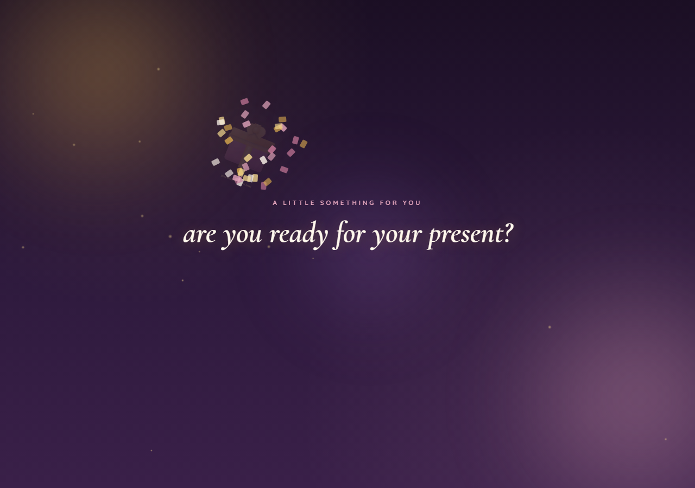

Click fires a confetti burst from the box center, plays the open animation, and after 750ms swaps
to the wish phase. The letter phase is deliberately jumped over here.

## 5. Make a wish — candles lit

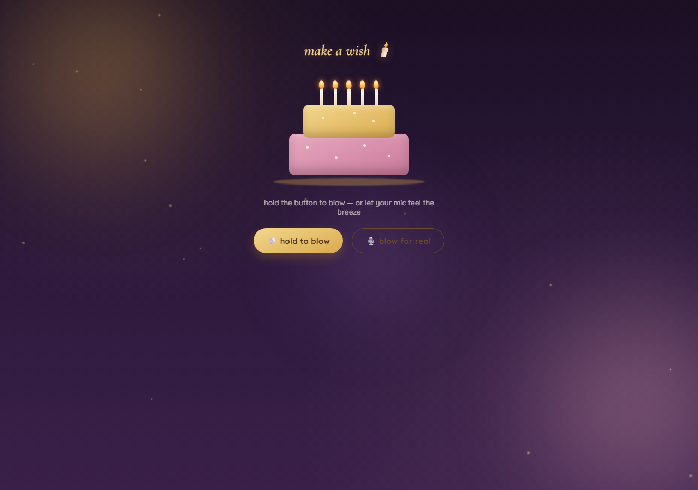

Five lit candles, two ways to blow them out.
Holding "hold to blow" extinguishes one candle immediately, then one more every 450ms.
"blow for real" asks for microphone access and extinguishes a candle whenever the average
frequency level crosses 26, at most one every 350ms.

## 6. Make a wish — granted

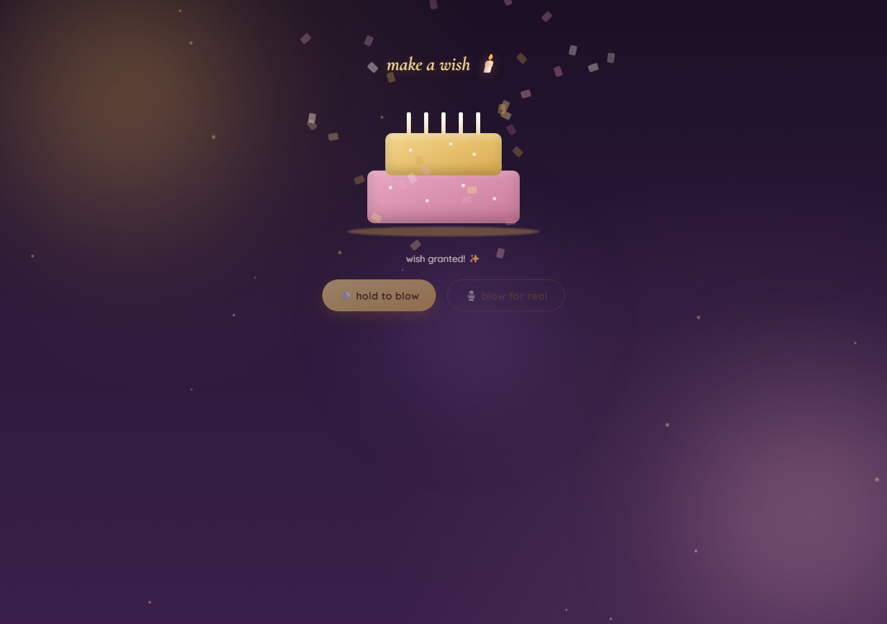

When the last candle goes out both buttons are disabled, the hint becomes "wish granted!", and
confetti fires. The next phase arrives 3 seconds later.

## 7. Reasons — face down

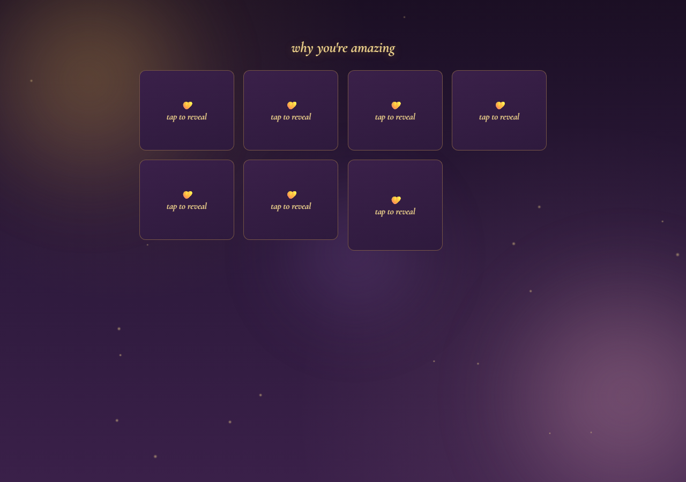

Seven cards, each showing "tap to reveal". Cards are keyboard reachable and respond to Enter and Space.

## 8. Reasons — flipping

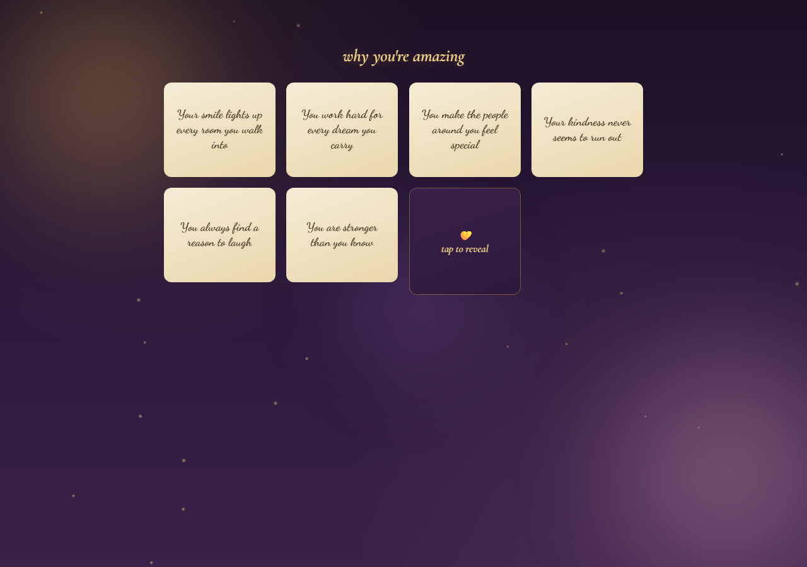

Each card flips independently. Flipping a revealed card back down decrements the counter, so the
phase can be held open indefinitely.

## 9. Reasons — all revealed

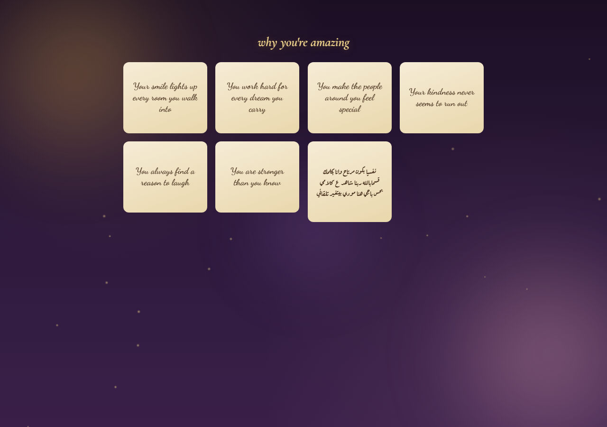

Six English messages and one longer Arabic message. Once all seven are face up the crown phase
arrives 1.5 seconds later.

## 10. Crown — initial

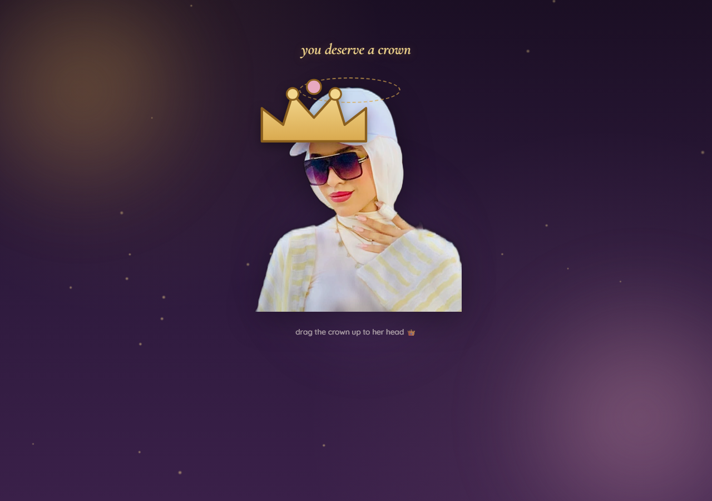

A photo with an invisible drop zone over the head, and a draggable crown below it.

## 11. Crown — fitted

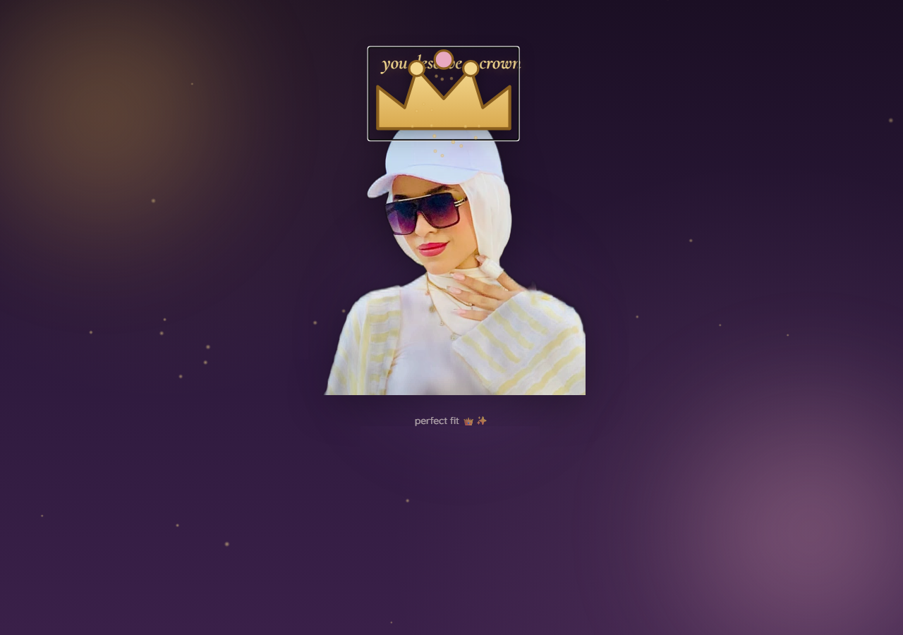

Drop the crown within 100px of the zone center and it snaps into place, the hint becomes
"perfect fit", sparkles fire, and memories arrives about 2.9 seconds later.
Two shortcuts also trigger the snap: a drag shorter than 6px, meaning a plain click, and pressing
Enter or Space while the crown is focused. This shot used the Enter path.

## 12. Memories

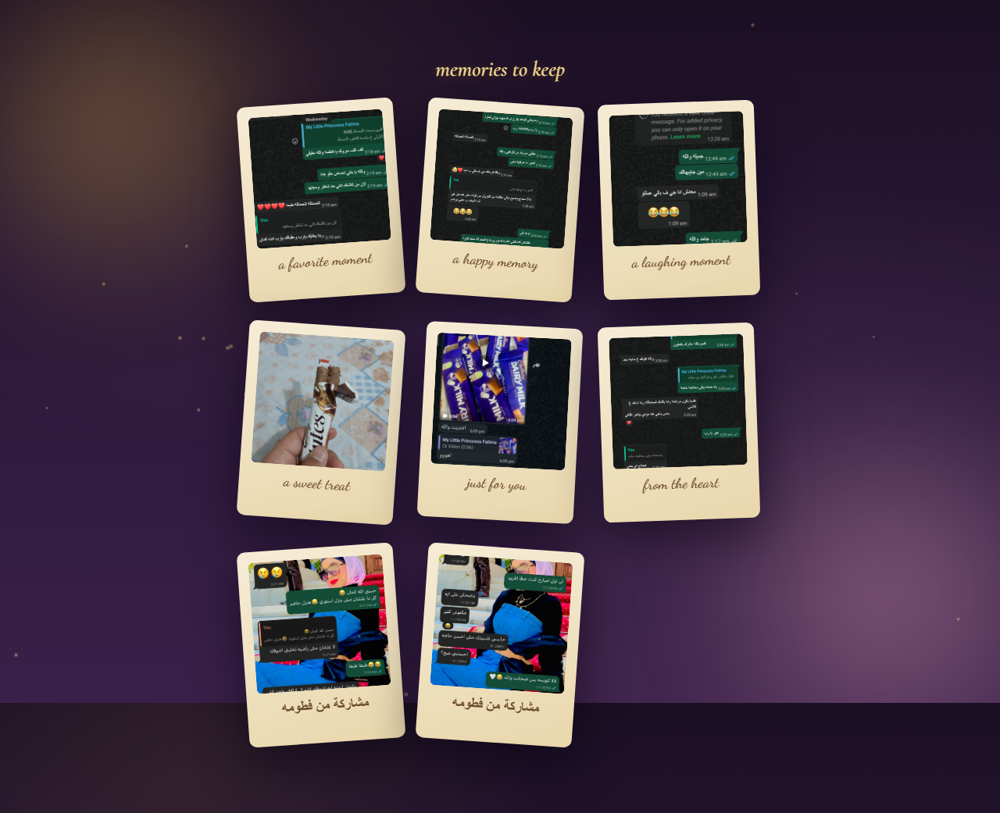

Eight polaroid cards, six English captions and two Arabic. Static, no interaction, and the final
screen of the experience.

---

## Dormant screens

These load into the DOM on every run and their handlers are wired, but nothing in the flow reveals
them. The two shots below were forced visible to document them.

### Letter

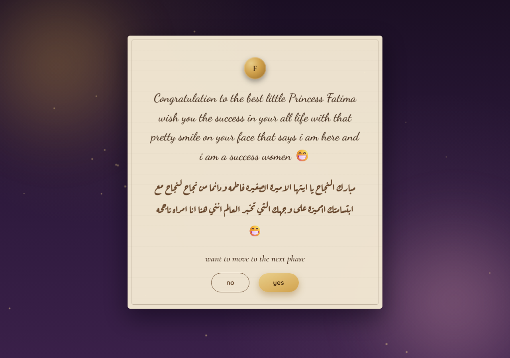

A bilingual congratulation note with a "no" and a "yes" button. The yes button runs away and shows
a random taunt in a speech bubble. Clicking "no" unlocks yes in place, and yes then advances.
To restore it, show `phaseLetter` instead of `phaseWish` inside `openGift` in [gift.js](../js/gift.js).

### Celebration video


Plays `video/Congratulations.mp4` and advances 1 second after the video ends.
To restore it, show `phaseVideo` inside `goToFinale` in [letter.js](../js/letter.js).

---

## Mobile

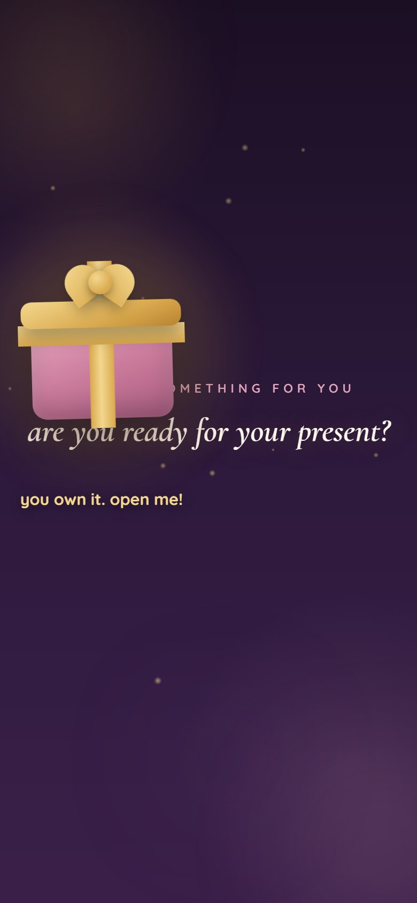

390x844. The ambient sparkle count drops from 30 to 16 below 600px wide.
Every phase is touch driven, and the crown uses pointer events so drag works on touch.

---

## Notes from the run

- **Memories init always warns.** [memories.js:8](../js/memories.js#L8) requires exactly 6 photo
  cards but the section ships 8, so the guard fires `Memories phase incomplete` and returns early.
  Harmless today because that phase has no handlers, but the check will keep failing.
- **The crown snaps high.** In shot 11 the crown floats above the cap and overlaps the heading
  rather than resting on it. The offset comes from the `0.72` height factor in
  [crown.js:40](../js/crown.js#L40).
- **Timers are not skippable.** The 5s gift wait, 3s after the wish, 1.5s after the reasons and
  2.9s after the crown are fixed. Total forced waiting is roughly 12 seconds.
- **Reduced motion only affects ambient sparkles.** Phase transitions, flips and confetti still animate.

---

For rebuilding this from scratch with new ideas, see [SPEC.md](SPEC.md).
